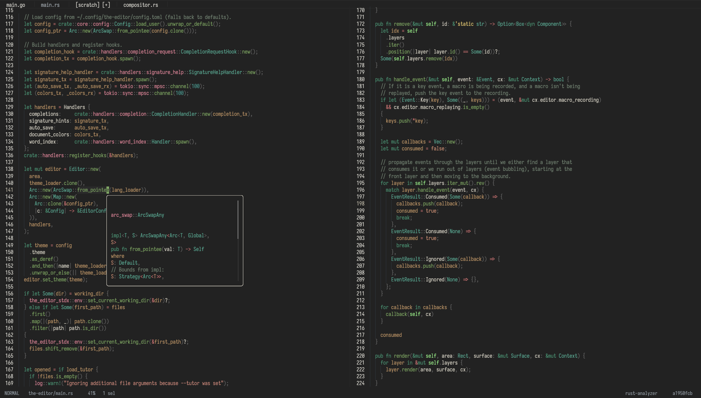

# the-editor

> **Note**: We don't have an alpha release yet. See [`docs/TODO.md`](docs/TODO.md) for what's left to be done before that happens.



## Features

**the-editor** is a modern, high-performance text editor written in Rust, inspired by [Helix](https://helix-editor.com/). It combines the powerful modal editing paradigm of Helix/Kakoune with a native GUI built on a custom WGPU renderer.

### Core Features

- **Helix-inspired modal editing**: Selection-first editing model where you select first, then act
- **Native multicursor support**: Built-in support for multiple cursors following the helix-kakoune model (selection → action)
- **Custom WGPU renderer**: GPU-accelerated rendering for smooth, responsive UI
- **Full LSP integration**: Built-in Language Server Protocol support with:
  - Code completion
  - Diagnostics (errors, warnings, hints)
  - Hover information
  - Signature help
  - Go to definition/declaration
  - And more...
- **Extremely fast**: Optimized for performance with minimal overhead
- **Low memory footprint**: Efficient memory usage even with large files
- **Lightweight**: Minimal dependencies, fast startup time

## Installation

Currently, **the-editor** only supports installation through Nix flakes.

### Adding the Flake Input

Add the-editor to your flake inputs:

```nix
{
  inputs = {
    # ... your other inputs
    the-editor = {
      url = "github:misterclayt0n/the-editor";
      inputs.nixpkgs.follows = "nixpkgs";
    }; 
  };
}
```

### Installing

In your Nix configuration (e.g., `home.nix` or `configuration.nix`):

```nix
home.packages = [
  the-editor.packages.${system}.default
];
```

Or if you're using it as a flake input in your system configuration:

```nix
environment.systemPackages = [
  inputs.the-editor.packages.${system}.default
];
```

Then rebuild your system/home-manager configuration:

```bash
# For NixOS
sudo nixos-rebuild switch --flake .#your-hostname

# For home-manager
home-manager switch --flake .#your-username@your-hostname
```

## Development

See the [Repository Guidelines](AGENTS.md) for build, test, and development commands.

## Status

**the-editor** is currently in active development and has not reached alpha status yet. For a detailed list of what's remaining before the first release, see [`docs/TODO.md`](docs/TODO.md).

## License

<!-- TODO: Add license information -->
